# Booking 🛎

체육 시설 예약을 도와주는 서비스
**https://booking-nailseong.com/**

<br>

---

## Table of Contents

- [General Info](#general-Info)
  - [Stack](#stack)
  - [Preview](#preview)
- [Schema](#schema)
  - [User](#user)
  - [Booking](#booking)
  - [Place](#place)
  - [Team](#team)
- [Unit Test](#unit-test)
  - [User Service](#user-service)
  - [Booking Service](#booking-service)
  - [Place Service](#place-service)
  - [Team Service](#team-service)
  - [Coverage](#coverage)
- [API](#api)
  - [Query](#query)
  - [Mutation](#mutation)

---

## General info

### Stack

<a href="https://nestjs.com/" target="_blank">NestJS</a>, <a href="https://www.typescriptlang.org/" target="_blank">TypeScript</a>, <a href="https://graphql.org/" target="_blank">GraphQL</a> and <a href="https://www.postgresq" target="_blank">PostgreSQL</a>

### Preview

> 직접 확인해 볼 수 있습니다! &rarr; **https://booking-nailseong.com/**
> Frontend &rarr; **https://github.com/naIlSeong/booking-frontend**

- **회원가입 & 로그인**

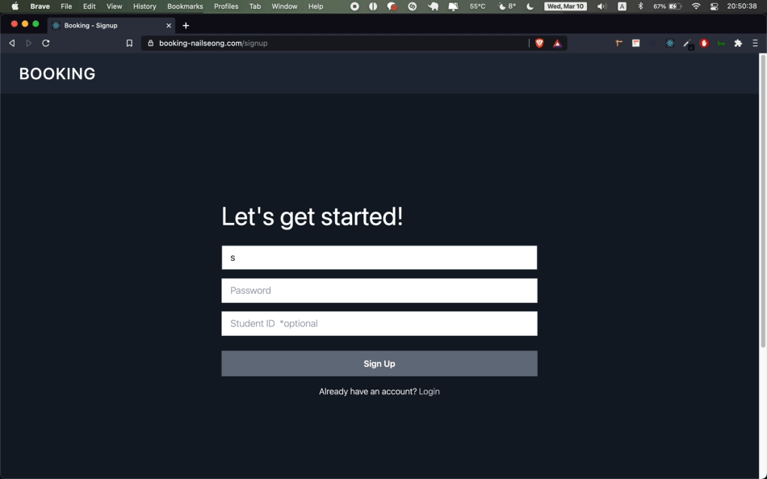

</br>

- **이용 시작**

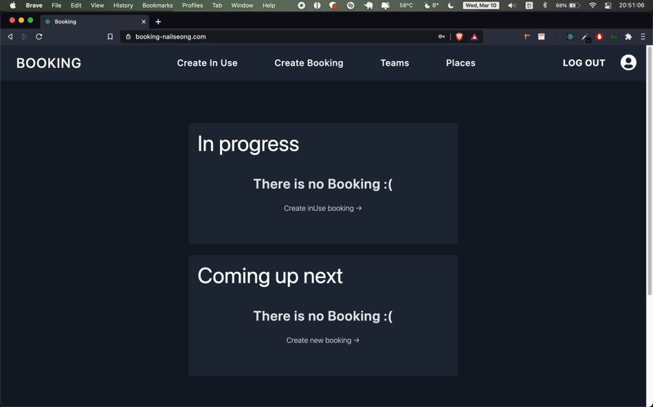

</br>

- **시설 예약**

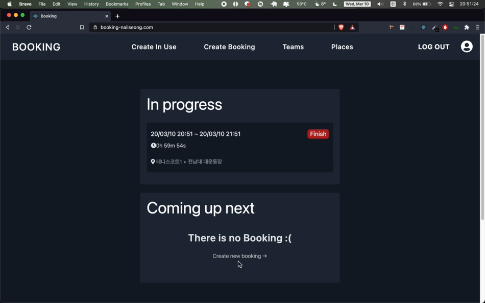

</br>

- **검색**

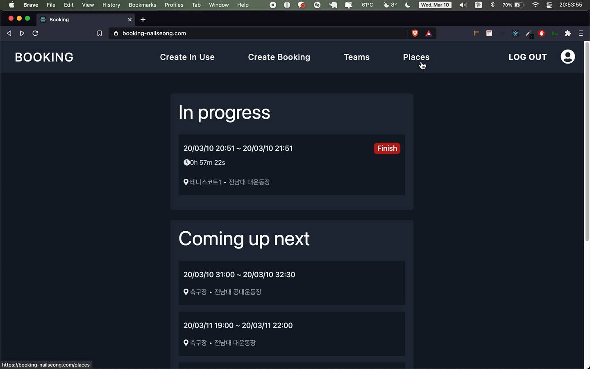

</br>

- **이용 종료**

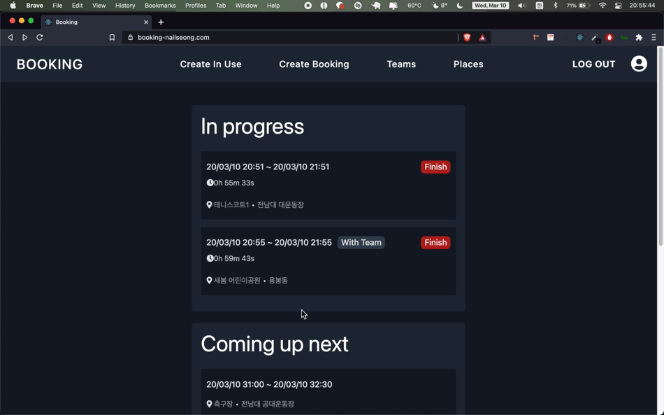

</br>

- **팀 만들기**

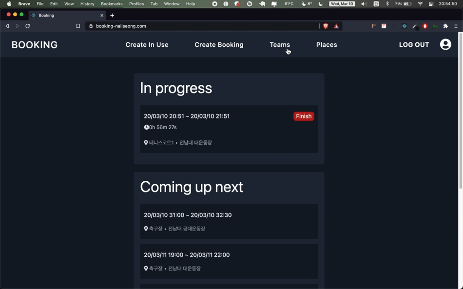

</br>

- **팀 가입**

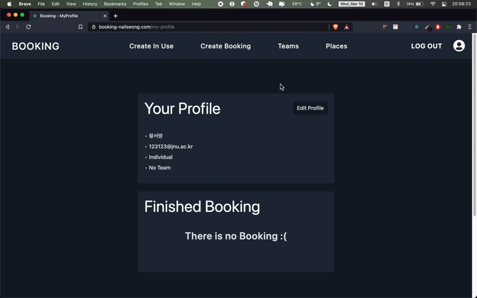

</br>

- **이용 연장**

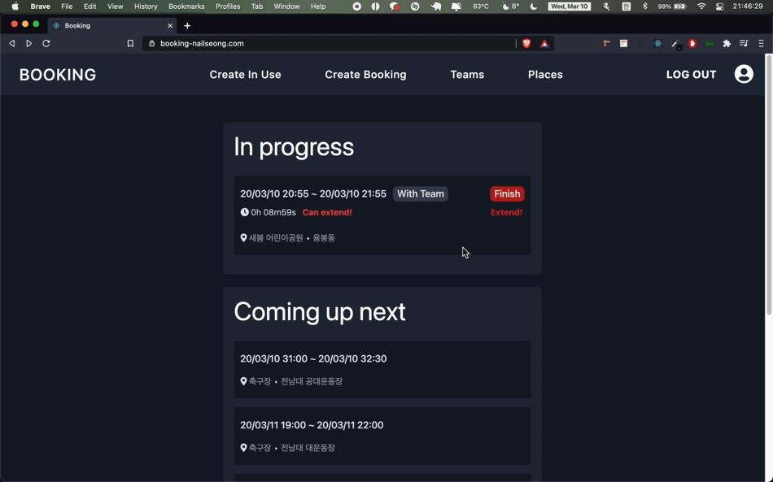

</br>

## <br>

---

## Schema

### User

```User Schema
type User {
  id: Int!

  createdAt: DateTime!

  updatedAt: DateTime!

  studentId: Int

  studentEmail: String

  username: String!

  usernameSlug: String!

  password: String!

  role: UserRole!

  // ManyToMany
  bookings: [Booking!]

  // OneToMany
  CreatedBooking: [Booking!]

  // ManyToOne
  team: Team
}

enum UserRole {
  Admin
  Individual
  Representative
  Member
}
```

### Booking

```Booking Schema
type Booking {
  id: Int!

  createdAt: DateTime!

  updatedAt: DateTime!

  // ManyToOne
  place: Place!

  // ManyToOne
  team: Team

  // ManyToOne
  creator: User!

  startAt: DateTime!

  endAt: DateTime!

  inUse: Boolean!

  isFinished: Boolean!

  canExtend: Boolean!
}
```

### Place

```Place Schema
type Place {
  id: Int!

  createdAt: DateTime!

  updatedAt: DateTime!

  placeName: String!

  placeNameSlug: String!

  // ManyToOne
  placeLocation: PlaceLocation!

  // OneToMany
  bookings: [Booking!]

  inUse: Boolean!

  isAvailable: Boolean!
}
```

### Team

```Team Schema
type Team {
  id: Int!

  createdAt: DateTime!

  updatedAt: DateTime!

  teamName: String!

  teamNameSlug: String!

  // OneToMany
  members: [User!]!

  // OneToMany
  bookings: [Booking!]
}
```

---

## Unit Test

> `Jest`를 사용하였습니다.

### User Service

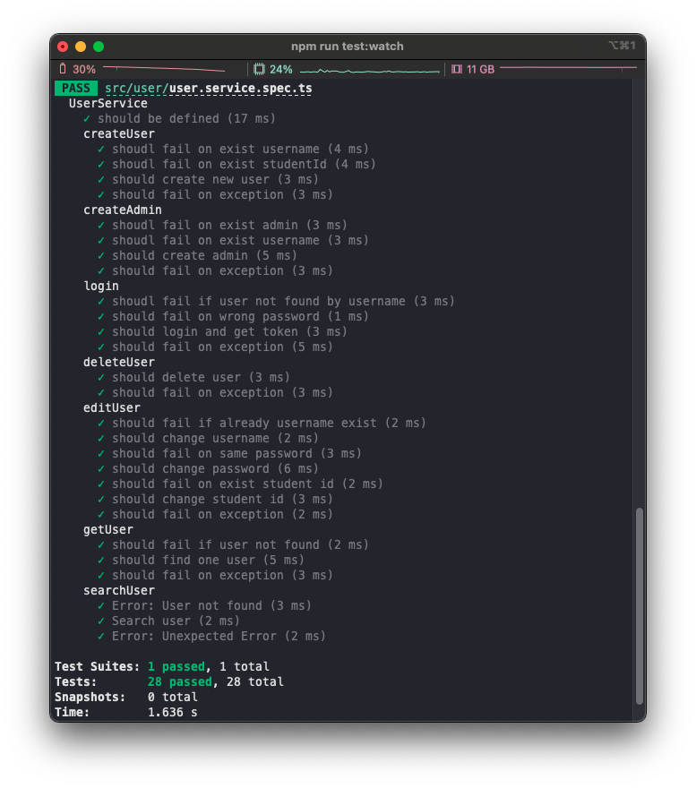

</br>

### Booking Service

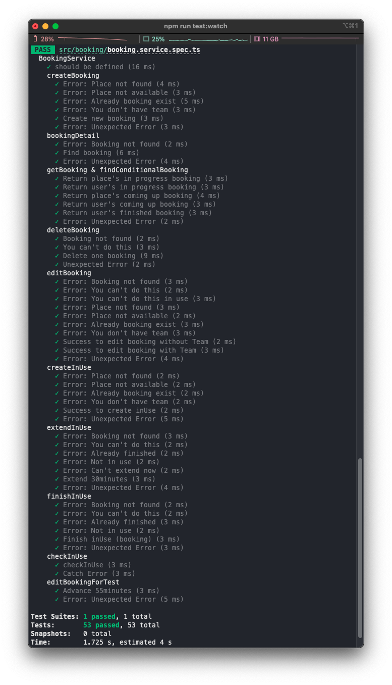

</br>

### Place Service

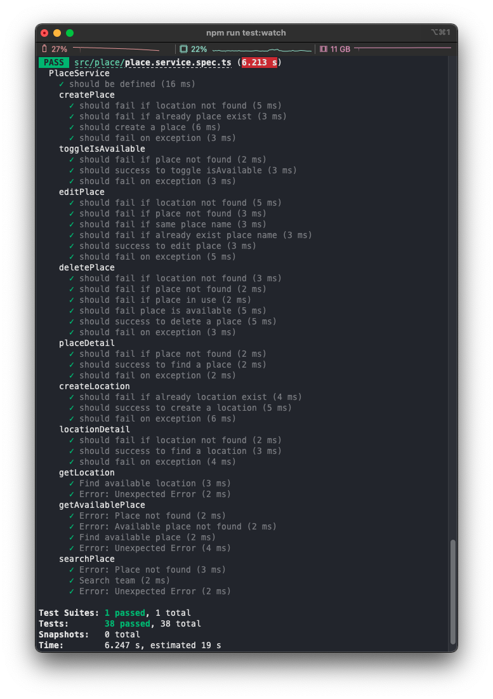

</br>

### Team Service

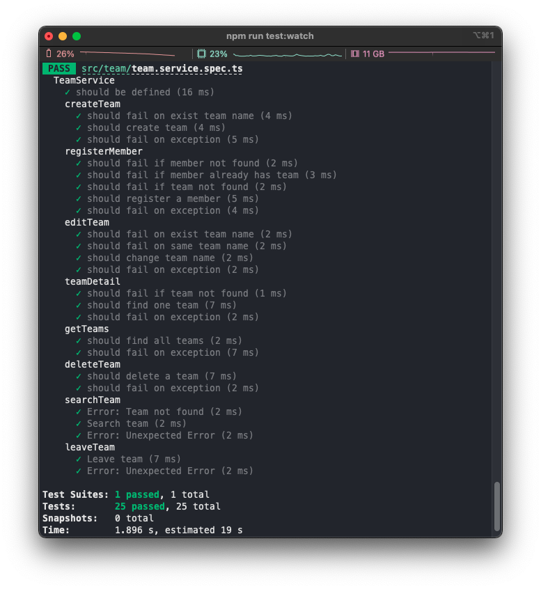

</br>

### Coverage


---

## API

### Query

### Mutation
