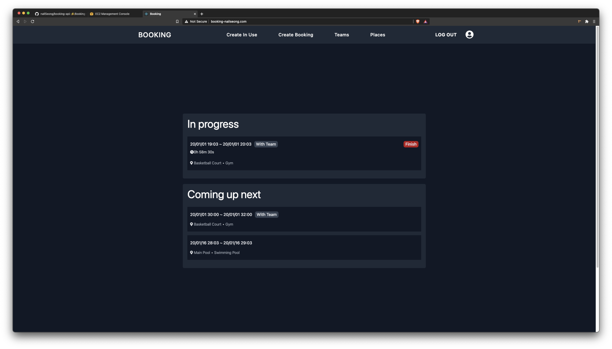
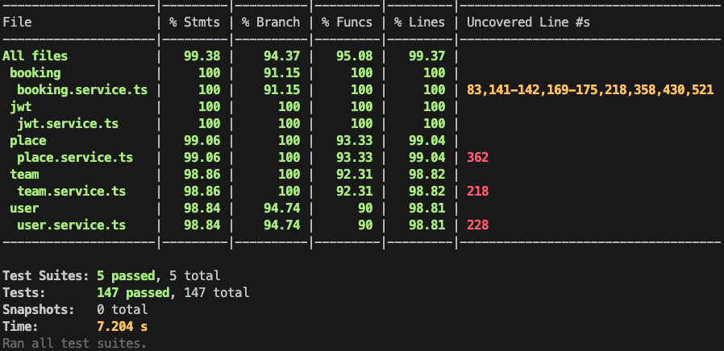
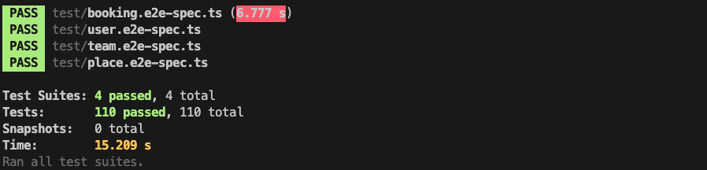

# Booking 🛎

Sports facility reservation service

<br>

---

## Table of contents

- [General info](#general-info)
- [Technologies](#technologies)
- [Installation](#installation)
- [Tests](#tests)

  <br>

---

## General info

CRUD Application made with [NestJS](https://nestjs.com/), [TypeScript](https://www.typescriptlang.org/), [GraphQL](https://graphql.org/) and [PostgreSQL](https://www.postgresql.org/)

**[http://booking-nailseong.com](http://booking-nailseong.com)**

[](http://booking-nailseong.com)

_<div align="center">Home page when logged in</div>_

## <br>

---

## Technologies

Project is created with:

**Backend**

- [NestJS](https://nestjs.com/) v7.5.1
- [TypeScript](https://www.typescriptlang.org/) v4.0.5
- [GraphQL](https://graphql.org/) v15.4.0
- [Jest](https://jestjs.io/) v26.6.3
- [PostgreSQL](https://www.postgresql.org/) v13
- [TypeORM](https://typeorm.io/#/) v0.2.29

  <br>

**Frontend** - https://github.com/naIlSeong/booking-frontend

- [React](https://ko.reactjs.org/) v17.0.1
- [GraphQL](https://graphql.org/) v15.4.0
- [TypeScript](https://www.typescriptlang.org/) v4.0.3
- [Apollo Client](https://www.apollographql.com/docs/react/) v3.3.6
- [Tailwind CSS](https://tailwindcss.com/) v2.0.2

 <br>

**Deploy**

- [AWS EC2](https://aws.amazon.com/ko/ec2/?ec2-whats-new.sort-by=item.additionalFields.postDateTime&ec2-whats-new.sort-order=desc)
- [Nginx](https://www.nginx.com/)

  <br>

---

## Installation

To run this project, install it locally using npm:

```
// First clone this repo and install dependencies
$ git clone https://github.com/naIlSeong/booking-api
$ cd booking-api
$ npm install
$ npm run start:dev
```

```
// Set environment variable

//.env.dev
DB_HOST=localhost
DB_PORT=5432
DB_USERNAME=postgres
DB_PASSWORD=1234
DB_DATABASE=booking
SALT=10
PRIVATE_KEY=yourPrivateKey
```

<br>

---

## Tests

To run test this project:

```
// Unit Test
$ npm run test:cov
```


<br>

```
// End To End Test
$ npm run test:e2e
```


